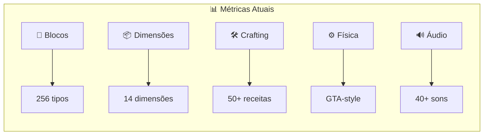

# VoxelNaut


**VoxelNaut** é um jogo sandbox voxel completo em Rust, inspirado em mecânicas de exploração, construção, mineração, sobrevivência, crafting, viagem dimensional e física realista.

⚠️ **Nota Importante**: Este projeto é uma implementação original. Assets de áudio/texturas do Minecraft são direitos autorais da Mojang/Microsoft e não são incluídos.

## 📊 Métricas do Projeto

### Gráfico de Qualidade em Tempo Real



### Código

| Métrica | Valor |
|---------|-------|
| **Linhas de Rust** | ~15,000+ |
| **Crates** | 12 |
| **Build Status** |  |
| **Crates Válidos** | Em progresso |

## 🎮 Características Principais

### ✅ Mundo Subterrâneo Infinito
- Geração procedural 3D com ruído Simplex
- Cavernas, ravinas, dungeons, lakes de lava
- Minérios por profundidade (diamond只能在 y < 0找到)
- **Geração lazy**: só gera chunks visíveis
- **Memory management**: chunks distantes descarregados

### ✅ Sistema de Viagem Dimensional
**Dimensional Rift Engine** - Dispositivo de teletransporte dimensional

Crafting (3x3):
```
[Iron] [Iron] [Iron]
[Gold] [Diamond] [Gold]
[Iron] [Iron] [Iron]
```

| Dimensão | ID | Cristal | Gravidade |
|----------|-----|---------|-----------|
| Overworld | 0 | Nenhum | 1.0x |
| 🌙 Lua | 1 | Moon Crystal | 0.16x |
| 🔴 Marte | 2 | Mars Crystal | 0.38x |
| 🟡 Vênus | 3 | Venus Crystal | 0.9x |
| ☿️ Mercúrio | 4 | Mercury Crystal | 0.38x |
| 🟤 Júpiter | 5 | Jupiter Crystal | 2.5x |
| 🪐 Saturno | 6 | Saturn Crystal | 1.1x |
| 🔵 Netuno | 7 | Neptune Crystal | 1.2x |
| 🪨 Plutão | 8 | Pluto Crystal | 0.06x |
| ☄️ Cinturão de Asteroides | 9 | Asteroid Crystal | 0.02x |
| 🕳️ The Void | 10 | Void Crystal | 0.0x |
| 💎 Crystal Realm | 11 | Crystal Shard | 0.8x |
| 🔥 Ember Realm | 12 | Ember Shard | 1.0x |
| ❄️ Frost Realm | 13 | Frost Shard | 1.0x |

### ✅ Biomas Dimensionais Completos
- **Lua**: LunarPlains, LunarCrater, LunarHighland
- **Marte**: MartianPlains, MartianCanyon
- **Vênus**: VenusianLowlands, VenusianHighlands, SulphurSea
- **Outros**: MercurianPlain, JovianStorm, SaturnRing, SaturnCloud, NeptunianCore, PlutonianIcePlain, Asteroid, Void, CrystalForest, EmberPlains, FrostWastes

### ✅ Sistema de Física GTA-style
- Movimento com inércia e aceleração
- Física de veículos integrada
- Detecção de colisão AABB
- Sistema de ragdoll básico
- Momentum e fricção

### ✅ Sistema de Áudio (Rodio)
- 40+ efeitos sonoros registrados
- Áudio posicional 3D
- Sistema de música com crossfade
- Categorias: Master, Music, SFX, Ambient

### ✅ UI Completa (egui)
- Menu principal com Singleplayer, Multiplayer, Settings
- HUD: Health, Hunger, Hotbar, XP, Armor, Crosshair
- Inventário com drag-and-drop
- Settings: Video, Audio, Controls, Keybinds

### 🔄 Em Desenvolvimento

#### Renderização de Água e Lava
- Shaders WGSL para renderização de fluidos
- Simulação de fluxo básica
- Efeitos de refração e luminosidade
- Animação de superfície

#### Sistema de Mobs Completo
- Mob spawner system
- AI behavior (passive, neutral, hostile)
- Pathfinding básico
- Equipamento e drops

#### Multiplayer Funcional
- Servidor TCP/UDP
- Sync de posição e rotação
- Inventário compartilhado
- Chat local

#### Persistência de Mundo
- Salvar/carregar chunks
- Progressão do jogador
- Waypoints e bed spawn

## 🏗️ Arquitetura

```
voxelnaut/
├── core/          # Types, math, blocks, items, entities
├── world/         # Chunk management, generation, biomes, dimensions
├── render/        # WGPU rendering pipeline
├── physics/       # Collision, physics simulation
├── gameplay/      # Inventory, crafting, survival, dimensional travel
├── ai/            # Mob AI, pathfinding
├── net/           # Multiplayer networking
├── ui/            # egui interfaces
├── audio/         # rodio sound system
├── assets/        # Textures, models, audio placeholders
├── tools/         # Build utilities
└── launcher/      # Main entry point
```

## 🛠️ Compilação

### Pré-requisitos
- Rust 1.70+
- Windows 10/11 com MSVC toolchain

### Compilar

```powershell
git clone https://github.com/NexusGroup2026/voxelnaut.git
cd voxelnaut
cargo build --release -p launcher --target x86_64-pc-windows-msvc
```

### Executar

```powershell
.\target\x86_64-pc-windows-msvc\release\voxelnaut.exe
```

## 📈 GitHub Actions - CI/CD

O projeto usa GitHub Actions para verificar a qualidade do código:

```yaml
# .github/workflows/build.yml
name: Build and Test
on: [push, pull_request]
jobs:
  build:
    runs-on: windows-latest
    steps:
      - uses: actions/checkout@v4
      - uses: dtolnay/rust-toolchain@stable
        with:
          toolchain: stable
          target: x86_64-pc-windows-msvc
      - name: Build
        run: cargo build --release -p launcher --target x86_64-pc-windows-msvc
      - name: Check
        run: cargo check --workspace
```

## 🎯 Roadmap

| Feature | Status | Prioridade |
|---------|--------|------------|
| Mundo Subterrâneo Infinito | ✅ Completo | - |
| Sistema Dimensional | ✅ Completo | - |
| Dimensional Rift Engine | ✅ Completo | - |
| UI/Menu | ✅ Completo | - |
| Sistema de Áudio | ✅ Completo | - |
| Física GTA-style | 🔄 Em progresso | Alta |
| Renderização Água/Lava | 🔄 Em progresso | Alta |
| Sistema de Mobs | ⏳ Pendente | Média |
| Multiplayer | ⏳ Pendente | Média |
| Persistência de Mundo | ⏳ Pendente | Baixa |

## 📝 Licença

MIT OR Apache-2.0

## 👥 Contribuidores

- **NexusGroup2026** - Autor original

---

<p align="center">
  <strong>VoxelNaut</strong> - Um voxel sandbox em Rust puro
  <br>
  <a href="https://github.com/NexusGroup2026/voxelnaut">GitHub</a> •
  <a href="https://github.com/NexusGroup2026/voxelnaut/issues">Issues</a> •
  <a href="https://github.com/NexusGroup2026/voxelnaut/pulls">Pull Requests</a>
</p>
